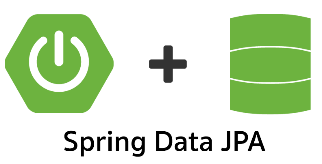

# sistemawebapp
**TECNOLOGIAS APLICADAS**

           

**FUNCIONALIDADES**

⚪ CRUD de Películas 

⚪  Registro de Clientes

🟢 Gestión de Alquileres y Devoluciones

✅  Formularios con validación (Hibernate Validator)

🔵 Vistas dinámicas con Thymeleaf y Bootstrap

🟣 Integración con PostgreSQL/Supabase

**AUTOR**
🔮NICOLE TRASLAVIÑA @Alanistm20

**paso 1- cumplir con los requerimientos del examen-**

**USAREMOS LAS ANOTACIONES DE SPRING**
🟣 **@Repository**
este ejemplo es de **AlquilerRepository**

package com.cibertec.alquiler_webapp.repository;
import com.cibertec.alquiler_webapp.model.Alquiler;
import org.springframework.data.jpa.repository.JpaRepository;
public interface AlquilerRepository     extends JpaRepository<Alquiler, Long> {
}

🟣 **@Controller** -**@Autowired**
este ejemplo es de **Extraido de AlquilerController**

import org.springframework.beans.factory.annotation.Autowired;
import org.springframework.stereotype.Controller;
import org.springframework.ui.Model;
import org.springframework.validation.BindingResult;
import org.springframework.web.bind.annotation.*;

@Controller
@RequestMapping("/alquileres")
public class AlquilerController {

    @Autowired
    private AlquilerService alquilerService;

🟣 **@service**
este ejemplo es de **Extraido de AlquilerService.java**

package com.cibertec.alquiler_webapp.service;
import com.cibertec.alquiler_webapp.model.Cliente;
import java.util.List;

public interface ClienteService {
    List<Cliente> listarTodos();
    Cliente guardar(Cliente cliente);
    Cliente buscarPorId(Long id);
    void eliminar(Long id);
}

🟣 **veremos Alquiler.java**

package com.cibertec.alquiler_webapp.model;

import jakarta.persistence.*;
import lombok.AllArgsConstructor;
import lombok.Data;
import lombok.NoArgsConstructor;
import java.util.ArrayList;
import java.util.List;
import java.math.BigDecimal;
import java.time.LocalDate;

@Data
@NoArgsConstructor
@AllArgsConstructor
@Entity
public class Alquiler {
    @Id
    @GeneratedValue(strategy = GenerationType.IDENTITY)
    private Long id;
    @Column(nullable = false)
    private LocalDate fechaAlquiler;
    private LocalDate fechaDevolucion;
    private BigDecimal montoTotal;
    @Enumerated(EnumType.STRING)
    @Column(nullable = false)
    private EstadoAlquiler estado;
     @ManyToOne(optional = false)
    @JoinColumn(name = "id_cliente")
    private Cliente cliente;
    @OneToMany(mappedBy = "alquiler", cascade = CascadeType.ALL, orphanRemoval = true)
    private List<DetalleAlquiler> detalles = new ArrayList<>();}

aqui vemos la relacion @ManyToOne y @OneToMany , muchos a uno y uno a muchos, y vemos el string que no acepte valores nulos, la fecha de alquiler tampoco acepta valores nulos

🟣 **El estado del alquiler (estado) será un enum con valores: Activo, Devuelto, Retrasado.**
🟣 **extraido de EstadoAlquiler.java**
package com.cibertec.alquiler_webapp.model;

public enum EstadoAlquiler {
    ACTIVO, DEVUELTO, RETRASADO
}

**paso 2- crear bd**
tabla clientes: (id_cliente, nombre, email). Define tipos y longitudes. Inserta 3 registros de prueba. 
CREATE TABLE clientes ( 
    id_cliente SERIAL PRIMARY KEY, 
    nombre VARCHAR(100) NOT NULL, 
    email VARCHAR(100) NOT NULL ); 

**tabla peliculas: (id_pelicula, titulo, genero, stock). Inserta 3 registros de prueba** 
CREATE TABLE peliculas ( 
    id_pelicula SERIAL PRIMARY KEY, 
    titulo VARCHAR(150) NOT NULL, 
    genero VARCHAR(50), 
    stock INT NOT NULL ); 

**tabla alquileres: (id_alquiler autogenerado, fecha, id_cliente, total).**
CREATE TABLE alquileres ( id_alquiler SERIAL PRIMARY KEY, fecha DATE NOT NULL DEFAULT CURRENT_DATE, id_cliente INT REFERENCES clientes(id_cliente), total NUMERIC(10,2) NOT NULL ); 

**tabla detalle_alquiler: clave compuesta (id_alquiler, id_pelicula), cantidad.**
CREATE TABLE detalle_alquiler ( id_alquiler INTEGER REFERENCES alquileres(id_alquiler) ON DELETE CASCADE, id_pelicula INTEGER REFERENCES peliculas(id_pelicula), cantidad INTEGER NOT NULL, PRIMARY KEY (id_alquiler, id_pelicula) ); 

